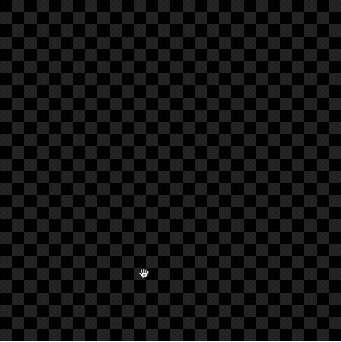

# Pixelated Canvas

A canvas that lets you draw in a pixelated, 8-bit style.



## Demo

[See a live demo](https://thekevinscott.github.io/pixelated-canvas/).

## Quickstart

```
import Canvas from 'pixelated-canvas';
const canvas = new Canvas();
canvas.render(document.body);
```

## API

The following props are supported:

* `width`
* `height`
* `xPixels`
* `yPixels`

```
const canvas = new Canvas({
  width: 500,
  height: 500,
  xPixels: 20,
  yPixels: 10,
});
```

`pixelSize` can also be set after instantiation with:

```
canvas.setPixelSize(20, 20);
```

The following callbacks are supported:

* `onMouseDown`
* `onMouseUp`
* `onMouseMove`

```
canvas.onMouseDown((e) => {
});

canvas.onMouseUp((e) => {
});

canvas.onMouseMove((e) => {
});
```

## License

[MIT](LICENSE)


